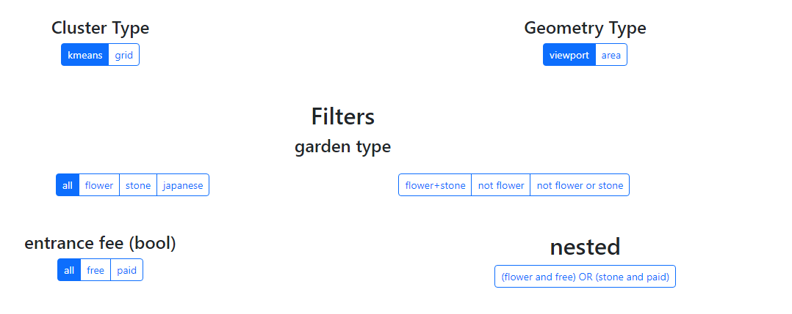
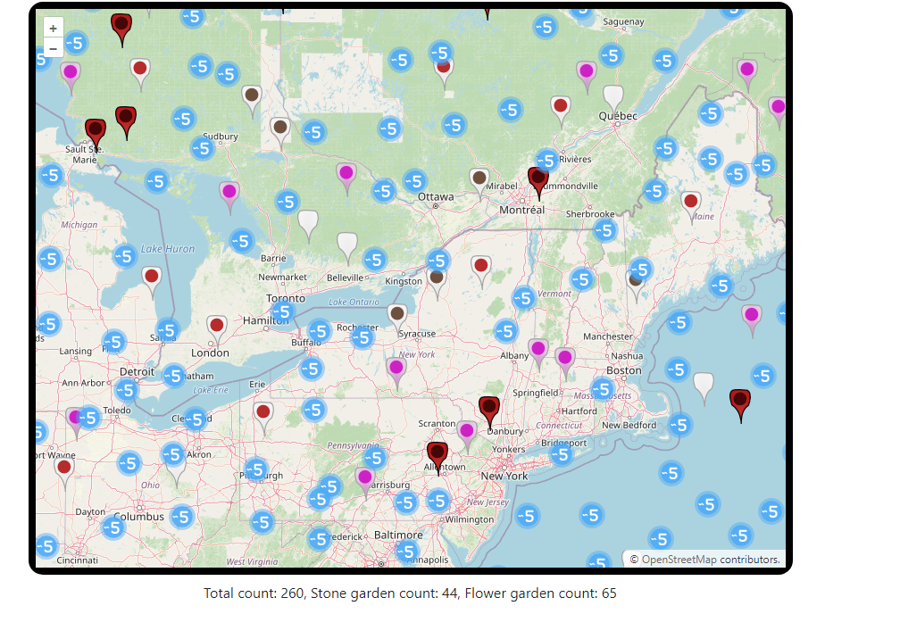
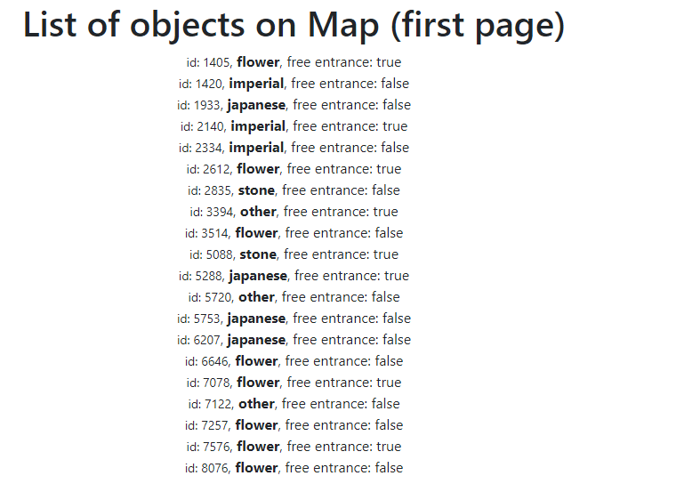

djangoMapCluster (POSTGIS version)
==================================

djangoMapCluster facilitates server-side clustering of map markers for GeoDjango, ideal for handling large datasets of markers. 
Performance varies by server capacity, typically supporting between 200,000 and 500,000 markers effectively.

Features
--------

djangoMapCluster provides two primary clustering techniques:
- Clustering via a grid system
- Clustering by the geometric density of points (requires PSQL extension)
- Allows clustering of any geographical shape, such as Polygons or Multipolygons
- Retrieves all items within a specific cluster

Additionally, it includes a caching feature that processes only new map areas when the user navigates the map.

It also offers extensive customization options:
- Compatible with OpenLayers, Google Maps, and Leaflet
- Customizable actions on cluster clicks
- Customizable cluster icons
- Adjustable grid sizes and other clustering parameters
- Filter application on clusters
- Specialized markers or pins for solitary items

Performance Tips
----------------

- Proper indexing of GIS database columns is crucial
- SSDs can offer a performance boost of 10-20 times over HDDs

Demo Screenshots
----------------

### Filter Menu

*This image shows the filter menu where users can apply different filters to the map data.*

### Map Markers

*This image displays the map with markers representing clustered data points.*

### Marker List

*This image shows a list of markers, providing detailed information about each data point on the map.*